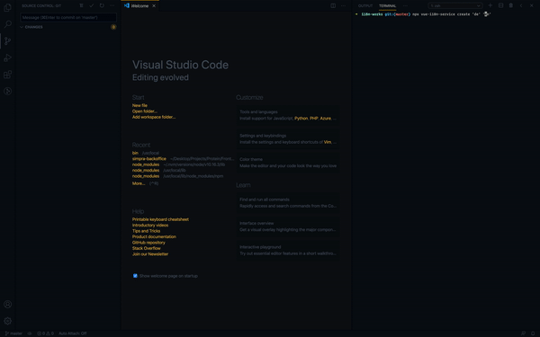

# vue-i18n-service

The translation team (not developers) wants **a** file with all the keys to translate. But I love to use translations in **Single File Components**.

And I found a solution to make everyone happy: `vue-i18n-service export|import`

Vue I18n Service makes to manage SFC translations easier in a file. It collects all the `<i18n>` definitions in Single File Components and collects them into a file.

## What's the flow:
`Hello.vue`
```vue
<template>
  <div>{{ hello }}</div>
</template>

<i18n>
{
  "en": {
    "hello": "Hi 🙁"
  },
  "tr": {
    "hello": "Selam"
  }
}
</i18n>
```

⬇️`npx vue-i18n-service export > translations.json`
```json
{
  "src/components/Hello.vue": {
    "en": {
      "hello": "Hi 🙁"
    },
    "tr": {
      "hello": "Selam"
    }
  }
}
```

✏️`translations.edited.json`

```json
{
  "src/components/Hello.vue": {
    "en": {
      "hello": "Hello 🙂"
    },
    "tr": {
      "hello": "Merhaba"
    }
  }
}
```

### Editing `translations.json` using Web UI

Open [https://edisdev.github.io/vue-i18n-translator/](https://edisdev.github.io/vue-i18n-translator/) and drop `translations.json` file which you've just generated. It will parse it and generate an useful interface to translate.


⬇️`npx vue-i18n-service import < translations.edited.json`
```
updating file src/components/Hello.vue
```
```vue
<template>
  <div>{{ hello }}</div>
</template>

<i18n>
{
  "en": {
    "hello": "Hello 🙂"
  },
  "tr": {
    "hello": "Merhaba"
  }
}
</i18n>
```

And all is OK. Doesn't matter how many files you have, it simply distributes without any problem and any conflict.

## Exporting i18n's in SFCs

This will generate a `translations.json` file (or whatever you named).

```bash
npx vue-i18n-service export > translations.json
```

It has a simple format:

```json
{
  "<file path>": {
    "<locale>": {
      "<key>": "<value>"
    }
  }
}
```

Here is an example:

```json
{
  "src/components/Hello.vue": {
    "en": {
      "hello": "Hello"
    },
    "tr": {
      "hello": "Merhaba"
    }
  },
  "src/views/World.vue": {
    "en": {
      "world": "World"
    },
    "tr": {
      "world": "Dünya"
    }
  }
}
```

### --dir

By default, `vue-i18n-service` looks for SFCs in the `src/` directory, if your components are in another directory, specify it by passing the `--dir` flag:

```bash
npx vue-i18n-service export --dir=client/ > translations.json
```

## Importing `translations.json` file to the SFCs

After bulk changing files, you can distribute import all the files calling `import` command.

```bash
npx vue-i18n-service import < translations.json
```

This will update `.vue` files and replace them with changes.

## Creating new locale from other locale
  You can creating a new locale by copying another locale `create` command

  ```bash
  npx vue-i18n-service create 'newlocale' 'extendedLocale'
  ```

  


## Contributors

<table>
  <tr>
    <td align="center">
      <a href="https://github.com/f" target="_blank">
        
      </a>
      <br />
      <sub><b>Fatih Kadir Akın</b></sub>
    </td>
    <td align="center">
      <a href="https://github.com/edisdev" target="_blank">
        
      </a>
      <br />
      <sub><b>Hatice Edis</b></sub>
    </td>
    <td align="center">
      <a href="https://github.com/paulgv" target="_blank">
        
      </a>
      <br />
      <sub><b>Paul Gascou-Vaillancourt</b></sub>
    </td>
  </tr>
</table>

## License

MIT.
